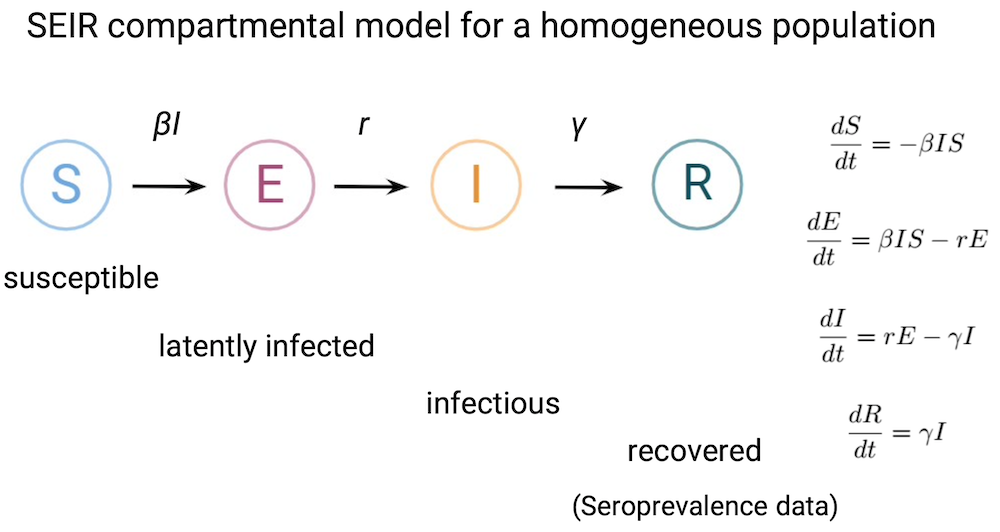
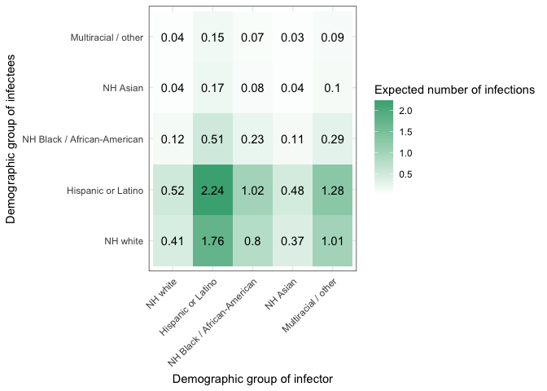
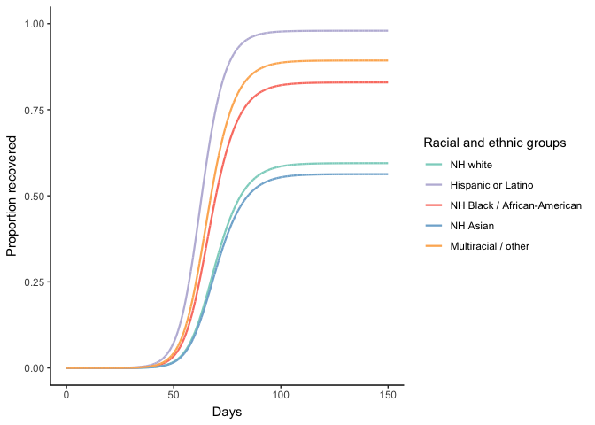

R code for SISMID 2021 Day 2 Heterogeneity and Herd Immunity Breakout
Session
================
12/3/2020

Minor Modifications: 2021/07/08

Load R libraries.

``` r
library(tidyverse)
library(deSolve)
library(RColorBrewer)
library(reshape2)
```

## (1) Set parameters to the SEIR model

``` r
g.parm = 1/4          # Mean infectious period of 4 days
r.parm = 1/3          # Mean latent period of 3 days
default.R0 = 3.0      # All analyses will be run assuming an R0 of 3

# Seroprevalence data are from Rosenberg et al. 2020 Table 2 and population census data are from 2018 ACS 1-year estimates Table B03002
# Ordering of vectors: non-Hispanic white, Hispanic or Latino, non-Hispanic Black / African-American, NH Asian, multiracial / other

# pop.loc = total population at given location
# pop.p.loc = fraction of each population belonging to each demographic group from census data; proportion for "other" group is given by 1 minus sum of all other groups
# sero.p.loc = adjusted cumulative incidence at given location for each demographic group
# sero.tested.loc = number of people tested at given location for each demographic group 

pop.nyc <- 8398748
pop.p.nyc <- c(0.319, 0.292, 0.217, 0.141, 0.032)
sero.p.nyc <- c(0.166, 0.330, 0.252, 0.145, 0.204)
sero.tested.nyc <- c(1758, 2103, 1392, 509, 184)
# Example: There are 8398748 people in NYC, of which 31.9% are non-Hispanic white. In the serosurvey, Rosenberg et al. tested 1758 non-Hispanic whites from NYC, of which 16.6% were seropositive (have SARS-CoV-2 antibodies, indicating they were infected at some point in the past).
pop.li <- 2839436
pop.p.li <- c(0.632, 0.186, 0.093, 0.068, 0.022)
sero.p.li <- c(0.087, 0.320, 0.158, 0.084, 0.207)
sero.tested.li <- c(1599, 301, 111, 50, 50)
```

Define the SEIR model. SEIR model with variable exposure for each
demographic group via social mixing matrix; also allows for varying
degrees of assortativity.



``` r
# epsilon = 0 gives proportionate mixing and epsilon = 1 gives fully assortative mixing

exposure.SEIR <- function(t, x, parms){           # Set up function with three arguments         
    with(as.list(c(t, x, parms)),{                # "with" lets us directly use the variables in parms
        S = c(S0, S1, S2, S3, S4)                 # S vector comprises susceptible counts for all groups...
        E = c(E0, E1, E2, E3, E4)                 # ... and similarly for the other compartments E through R
        I = c(I0, I1, I2, I3, I4)
        R = c(R0, R1, R2, R3, R4)
        beta <- (1-epsilon) * outer(activities, activities) / sum(pop * pop.p * activities) +
          epsilon*activities/(pop*pop.p)*diag(5)  # Transmission rates are dependent on...
                                                  # the contact rates of the two groups
                                                  # epsilon allows for assortative mixing
        beta <- beta/scaling.factor               # Scale beta so the R0 matches what we specified (default.R0 in the parameter section)

        dS <- -beta %*% I*S                       # System of rate equations in matrix formulation
        dE <- beta %*% I*S - r*E                  # Note the matrix multiplication (%*%) ...
        dI <- r*E - g*I                           # and element-wise-multiplication (*) ...
        dR <- g*I                                 # which matches the equations in the overview PDF
        der <- c(dS, dE, dI, dR)                  # Combine results into a single vector der
        list(der)                                 # Return result as a list       
    })
}
```

Create a `rescale.R0` function to center and generate plots.

``` r
# Rescale parameters so that R0 stays constant and plot NGM
#
# INPUT 
# beta = unscaled beta matrix
# g.parm = 1 / mean infectious period
# pop.p = vector of population proportion for each group
# N = total population size
# R0.value = desired R0
# ngm.plot = whether or not to plot the NGM
#
# OUTPUT
# A scaling factor for the NGM to set its dominant eigenvalue = desired R0
# N.B. Group A denotes non-Hispanic whites, B denotes Hispanics or Latinos, 
# ... C denotes non-Hispanic African-Americans, D denotes non-Hispanic Asians, 
# ... and E denotes multiracial or other demographic groups.

rescale.R0 <- function(beta, g.parm, pop.p, N, R0.value, ngm.plot=TRUE) {
    NGM.unscaled <- N*pop.p*beta*1/g.parm                         # Calculate (unscaled) next generation matrix
    dom.eigen <- as.numeric(eigen(NGM.unscaled)$values[1])        # Take dominant eigenvalue of unscaled NGM
    NGM.scaled <- NGM.unscaled/dom.eigen*R0.value                 # Then scale the NGM such that the dominant ...
                                                                  # eigenvalue is now the specified R0
    scaling.factor <- beta/(NGM.scaled/(N*pop.p)*g.parm)          # Calculate the scaling factor for beta 
    
    if (ngm.plot==TRUE){
        plot.NGM <- melt(NGM.scaled) %>%                          # Plot the next generation matrix in ggplot
              mutate(Var2 = factor(Var2-1)) %>%
              mutate(Var1 = factor(Var1-1))
        d <- ggplot(plot.NGM, aes(Var2, Var1)) +                  # Geom_tile produces nice 2D tiled rectangle plots
            geom_tile(aes(fill = value)) +
            geom_text(aes(label = round(value, 2))) +
            scale_x_discrete(labels = c('A','B','C','D','E')) +
            scale_y_discrete(labels = c('A','B','C','D','E')) +
            xlab('Demographic group of infector') +
            ylab('Demographic group of infectees') +
            labs(fill='Expected number of infections') + 
            scale_fill_gradient2(high='#47ad83') +
            theme(panel.background=element_rect(fill="white"),
                axis.ticks.x=element_blank(),
                axis.ticks.y=element_blank(),
                axis.title.y=element_text(margin = margin(t = 0, r = 5, b = 0, l = 0)),
                axis.title.x=element_text(margin = margin(t = 5, r = 0, b = 0, l = 0)))
        print(d)
        ggsave('model-ngm.png', width=6.5, height=3, dpi=300)
    }
    return(scaling.factor)
}
```

2.  Simulate variable exposure models given activity levels.

``` r
# INPUT 
# R0.value = desired R0
# pop = total population size
# pop.p = vector of population proportion for each group
# g.parm = 1 / mean infectious period
# fitted.vars = vector of activity or susceptibility levels (e.g. from ML fits)
# model = either 'suscep' or 'exposure'
# init.inf = vector of initial number of infecteds
# epsilon = assortativity parameter
# years = how many years to simulate for
# plot.days = how many days to plot for
# tstep = time step for simulations
# ci.plot = whether or not to plot the cumulative incidence trajectories
#
# OUTPUT
# A list containing final epidemic size, HIT, and cumulative incidence by group at the HIT

run.structured.model <- function(R0.value, pop, pop.p, g.parm, fitted.vars, model='exposure',
                                 init.inf=rep(1,5), epsilon=0, years=1, plot.days=150, tstep=0.01, ci.plot=TRUE) {
  
    N <- pop; N0 <- N*pop.p[1]; N1 <- N*pop.p[2]; N2 <- N*pop.p[3]; N3 <- N*pop.p[4]; N4 <- N*pop.p[5]
    
    inits <- c(S0=N0, S1=N1, S2=N2, S3=N3, S4=N4, E0=0, E1=0, E2=0, E3=0, E4=0, 
                I0=0, I1=0, I2=0, I3=0, I4=0, R0=0, R1=0, R2=0, R3=0, R4=0) 
    
    inits <- inits + c(-init.inf, rep(0,5), init.inf, rep(0,5)) # *** Initialize models with 1 infected in each group by default
    dt <- seq(0, 365*years, tstep)                              # *** Simulate for 1 year by default

    activities <- fitted.vars
    scale.beta <- (1-epsilon)*outer(activities, activities)/sum(pop*pop.p*activities) +    # Calculate un-scaled beta matrix
                  epsilon*activities/(pop*pop.p)*diag(5)
    scaling.factor <- rescale.R0(scale.beta, g.parm, pop.p, N, R0.value)                   # Rescale beta to match desired R0
    parms <- list(r=r.parm, g=g.parm, activities=activities,                               # *** List of parameters to pass
                  scaling.factor=scaling.factor, pop=pop, pop.p=pop.p, epsilon=epsilon) 
    
    simulation <- as.data.frame(lsoda(inits, dt, exposure.SEIR, parms=parms))              # *** Solve SEIR differential equations
     
    # Calculate final size by taking last time point    
    final.size <- simulation %>% 
          mutate(R = rowSums(select(., matches('R')))/N) %>%
          filter(row_number()==n()) %>%
          pull('R')
    
    # Calculate herd immunity threshold by calculating Rt (dominant eigenvalue method) and seeing where it drops below 1
    hit.result <- simulation %>%
            select(matches('S|time')) %>%
            rowwise() %>% 
            mutate(p.nonsuscep = 1-sum(c(S0, S1, S2, S3, S4))/N) %>%
            mutate(HIT0 = 1-S0/N0, HIT1 = 1-S1/N1, HIT2 = 1-S2/N2, HIT3 = 1-S3/N3, HIT4 = 1-S4/N4) %>%
            mutate(Rt = as.numeric(eigen(c(S0, S1, S2, S3, S4)*
                                         scale.beta/scaling.factor/g.parm)$values[1])) %>%
            ungroup()
    
    hit.result.subset <- hit.result %>% filter(Rt <= 1.0) %>% top_n(1, Rt)
    hit.value <- hit.result.subset %>% pull(p.nonsuscep) 
    hit.breakdown <- hit.result.subset %>% 
        select(HIT0, HIT1, HIT2, HIT3, HIT4) %>%
        unlist(use.names=FALSE)  
    
    # Plot epidemic cumulative incidence trajectories
    if (ci.plot==TRUE){
        # Normalize cumulative incidence
        plotdat <- simulation %>% 
            select(matches('R|time')) %>%
            mutate(R0 = R0/N0, R1 = R1/N1, R2 = R2/N2, R3 = R3/N3, R4 = R4/N4) %>%
            pivot_longer(-one_of(c('time')), names_to='Compartment', values_to='N')
        ylabel <- 'Proportion recovered'
    
        set3.palette.adjusted <- c(brewer.pal(name='Set3',n=6)[1], brewer.pal(name='Set3',n=6)[3:6])
        d <- ggplot(plotdat, aes(x=time, y=N, group=Compartment)) + 
                geom_line(linetype='solid', size=0.8, aes(col=Compartment)) + 
                scale_color_manual(
                  values=set3.palette.adjusted, 
                  name = 'Racial and ethnic groups',
                  labels = c('NH white', 'Hispanic or Latino', 'NH Black / African-American', 'NH Asian', 'Multiracial / other')) +
                ylim(0, 1) + xlim(0, plot.days) + theme_classic() + theme(
                    axis.title.y = element_text(margin = margin(t = 0, r = 5, 
                                                                b = 0, l = 0)),
                    axis.title.x = element_text(margin = margin(t = 5, r = 0, 
                                                                b = 0, l = 0))) +
                xlab('Days') + ylab(ylabel)
        print(d)
        ggsave('model-trajectories.png', width=6, height=3, dpi=300)
    }
    
    results <- list(round(final.size, 4), round(hit.value, 4), round(hit.breakdown, 4))
    names(results) <- c('Final epidemic size', 'HIT', 'Cumulative incidence by group at the HIT')
    return(results)
}
```

``` r
# For a given set of model parameters, calculate the negative log likelihood using the serosurvey data
#
# INPUT 
# parms = vector of parameters being optimized
# pop = total population size
# pop.p = vector of population proportion for each group
# sero.p = vector of seropositivity fraction for each group
# sero.tested = vector of number of samples from each group
# years = how many years to simulate for
# study.time = when the serosurvey was conducted relative to epidemic start in days
# model = 'suscep' or 'exposure'
#
# OUTPUT
# Negative log-likelihood from the binomial sampling process

binom.loglik <- function(parms, pop, pop.p, sero.p, sero.tested, years, init.inf, study.time, model){
    
    dt <- seq(0, 365*years, 0.5) # Larger time step used for ML fits 
    N <- pop; N0 <- N*pop.p[1]; N1 <- N*pop.p[2]; N2 <- N*pop.p[3]; N3 <- N*pop.p[4]; N4 <- N*pop.p[5]
    inits <- c(S0=N0, S1=N1, S2=N2, S3=N3, S4=N4, E0=0, E1=0, E2=0, E3=0, E4=0, 
                I0=0, I1=0, I2=0, I3=0, I4=0, R0=0, R1=0, R2=0, R3=0, R4=0) 
    inits <- inits + c(-init.inf, rep(0,5), init.inf, rep(0,5)) # Initialize models with 1 infected in each group by default

    if (model=='suscep'){
        parms['hazards'] <- parms['params']
        simulation <- as.data.frame(lsoda(inits, dt, suscep.SEIR, parms=parms))
    } else if (model=='exposure'){
        parms['activities'] <- parms['params']
        simulation <- as.data.frame(lsoda(inits, dt, exposure.SEIR, parms=parms))
    } else {
        stop('Model options are "suscep" or "exposure".')        
    }
    
    p.model <- simulation %>%
        filter(time == study.time) %>% # Serosurvey time point by default is t=100
                                       # Fitted values are agnostic to this choice up to a scaling factor
        mutate(R0 = R0/N0) %>%
        mutate(R1 = R1/N1) %>%
        mutate(R2 = R2/N2) %>%
        mutate(R3 = R3/N3) %>%
        mutate(R4 = R4/N4) %>%
        select(matches('R')) %>%
        unlist(., use.names=TRUE)  
    nll <- -sum(dbinom(x=round(sero.p*sero.tested), prob=p.model, size=sero.tested, log=TRUE))
    return(nll)
}


# Fit the model parameters by maximizing the binomial log-likelihood
#
# INPUT 
# pop = total population size
# pop.p = vector of population proportion for each group
# sero.p = vector of seropositivity fraction in each group
# sero.tested = vector of number of samples from each group
# r.parm = 1 / mean latent period
# g.parm = 1 / mean infectious period
# epsilon = assortativity parameter
# years = how many years to simulate for
# study.time = when the serosurvey was conducted relative to epidemic start in days
# init.inf = vector of initial number of infecteds
# model = 'suscep' or 'exposure'
#
# OUTPUT
# ML fit parameters normalized relative to NH whites

fit.model <- function(pop, pop.p, sero.p, sero.tested, r.parm, g.parm, epsilon=0, years=1, 
                      study.time=100,init.inf=rep(1,5), model='exposure') {
    
    fit.func <- function(par){
        parms <- list(r=r.parm, g=g.parm, params=par, scaling.factor=1, 
                      pop=pop, pop.p=pop.p, epsilon=epsilon)
        binom.loglik(pop=pop, pop.p=pop.p, sero.p=sero.p, sero.tested=sero.tested, parms=parms, years=years, study.time=study.time, init.inf=init.inf, model=model)
    }
    
    fit <- optim(fit.func, par=c(1,2,2,1,2), method='L-BFGS-B', lower=rep(1e-4, 5), upper=rep(20, 5))
    print(paste(c('Normalized fitted values:', round(fit$par/fit$par[1], 3)), collapse=' '))
    return(fit$par/fit$par[1])
}
```

``` r
### Proportionate mixing
# epsilon = 0 runs a proportionate mixing model

# Fit the activity levels using maximum likelihood
activities.pmix.li <- fit.model(
  pop=pop.li,
  pop.p=pop.p.li,
  sero.p=sero.p.li,
  sero.tested=sero.tested.li,
  epsilon=0,
  r.parm=r.parm, 
  g.parm=g.parm)      
#> [1] "Normalized fitted values: 1 4.31 1.956 0.916 2.475"

# Simulate the model with R0=3 and plot outputs / print results (HIT, final epidemic size)
results.pmix.li <- run.structured.model(R0.value=default.R0, pop=pop.li, pop.p=pop.p.li, epsilon=0, 
                                        g.parm=g.parm, fitted.vars=activities.pmix.li)
```

<!-- -->

    #> Warning: Removed 107500 row(s) containing missing values (geom_path).

    #> Warning: Removed 107500 row(s) containing missing values (geom_path).

<!-- -->

``` r
print(results.pmix.li)
#> $`Final epidemic size`
#> [1] 0.6932
#> 
#> $HIT
#> [1] 0.3977
#> 
#> $`Cumulative incidence by group at the HIT`
#> [1] 0.2861 0.7660 0.4828 0.2657 0.5658

# For the NGM plot, Group A denotes non-Hispanic whites, B denotes Hispanics or Latinos, 
# ... C denotes non-Hispanic African-Americans, D denotes non-Hispanic Asians, 
# ... and E denotes multiracial or other demographic groups.
```

``` r
### Assortative mixing

# Fit the activity levels using maximum likelihood
activities.amix.li <- fit.model(
  pop=pop.li, 
  pop.p=pop.p.li, 
  sero.p=sero.p.li, 
  sero.tested=sero.tested.li, 
  epsilon=0.5, r.parm=r.parm, g.parm=g.parm)      

# Simulate the model with R0=3 and plot outputs / print results (HIT, final epidemic size)
results.amix.li <- run.structured.model(
  R0.value=default.R0, 
  pop=pop.li, 
  pop.p=pop.p.li, 
  epsilon=0.5, 
  g.parm=g.parm, 
  fitted.vars=activities.amix.li)

results.amix.nyc <- run.structured.model(
  R0.value=default.R0, 
  pop=pop.nyc, 
  pop.p=pop.p.nyc, 
  epsilon=0.5, 
  g.parm=g.parm, 
  fitted.vars=activities.amix.nyc)

print(results.amix.nyc)

# For the NGM plot, Group A denotes non-Hispanic whites, B denotes Hispanics or Latinos, 
# ... C denotes non-Hispanic African-Americans, D denotes non-Hispanic Asians, 
# ... and E denotes multiracial or other demographic groups.
```
